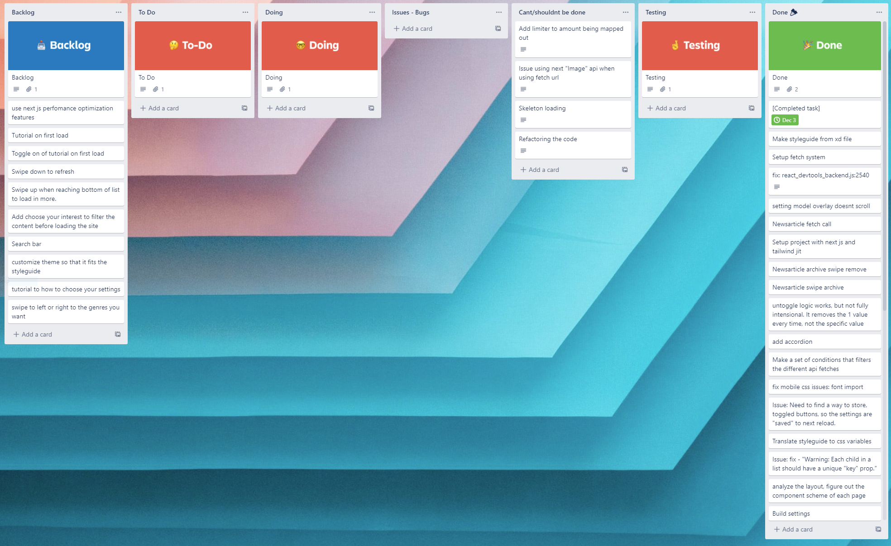

# Projektdokumentation

#### Navn: Christian Mogensen

##### Hold: WU06

##### Uddannelse: Webudvikler

##### Uddannelsessted: Roskilde Tekniske Skole

[Link til (min applikaton)](http://nogether.netlify.com/)

| Indholdsfortegnelse ||
| ----------- | ----------- |
| 1 | Teknologier |
| 2 | Redegørelse af trejdeparts pakker |
| 3 | Argumentation for valg |
| 4 | Vurdering af egen indsats |
| 5 | Særlige punkter |
| 6 | Bilag |


## Teknologier

-   Next / React js
-   Tailwind just-in-time
-   Framer Motion

---


# Redegørelse for oprindelsen af evt. tredjeparts kode anvendt i opgaveløsningen (Teknisk dokumentation)

Efter vi fik opgaven stillet, spurgte jeg om lov til at løse opgaven med - __React, Next og Tailwind__. Det skyldes fordi at det sted jeg har fået praktik. Har anbefalet mig til at få et ordentligt indblik i de teknologier. 

[__React__](https://reactjs.org/)\
React er størstedelen af opgaven, alt html/css bliver delt op i komponenter og strikket sammen til en applikation. Det smarte ved det, er genanvendeligheden i at strukturere koden på den måde.

[__Next__](https://nextjs.org/)\
React applikationen lever i Next js, hvor siderne linker til hinanden. Selve opgavens løsning er det relativt begrænset hvad der er blevet brugt fra deres bibliotek. Men der har været forsøg på at bruge nogle af deres indbygget API'er.

[__Tailwind__](https://tailwindcss.com/)\
Tailwind er css biblioteket der er blevet anvendt i opgaven. Det er et gigantisk bibliotek af *"utility classes"*. Hvad der er rigtig smart ved det er deres *"Just in time"* live compiler. Det der gør at biblioteket bliver purged og opdateret hver gang react app'en bliver compilet. Så man ender kun med det nødvendige tilbage og en css fil der fylder ingenting.

[__Framer Motion__](https://www.framer.com/motion/)\
Er et react bibliotek, der er specialiseret i at tilføre animation til ens komponenter på en simple måde. Det er ret avanceret hvad det kan lave og alle det animationer, jeg har ønsket til applikationen. Har det leveret. Her er der tale om:
- Swipe to arkive effekt.
- Stagger load-in af artikel elementerne.
- Små animationer på knapper og iconer.
- Give oplevelsen af at app'en bliver bygget op, ved det først sekund man er loaded ind.

---

# Argumentation for de valg du selvstændigt har truffet under løsningen af opgaven

> ### *(Hvilke overvejelser har du gjort dig, fx. i forbindelse med dit valg af animationer)*

Den første tanke, var angående *"Setting-siden (den hvor man vælger toggle knapper til ens artikler)"*. Der fandt jeg det oplagt at lave det til en modal, så det var en slags burger-menu. Så når man trykkede på tandhjulet, så slider settings modalen ovenfra og ned.

En anden association, var at lave en *"stagger-effect"* på hver artikler, efter man har trykket på accordionen. Stagger-effect, som i at artiklerne bliver loaded ind fra siden med en forsinkelse på 0.125 ms for hver artikel, så det bliver vist hurtigt og i sekvens.

Sidste overvejelse var at lave en standard load-in sekvens på header-delen af applikationen, så hvert element kommer ind i rækkefølge og fra forskellige sider. Det skulle give oplevelsen af at app'en blev bygget op hurtigt.


---
# Vurdering af egen indsats & gennemførelse af opgaveforløbet (Arbejdsgangen)

> ### *(Hvad gik godt. Hvor prioriterede du forkert. Klagesange fra de varme lande om halvfærdigt produkt, på grund af manglende nattesøvn, fordi din kæle-skildpadde havde tandpine er IKKE interessante.)*

Min egne forventninger blev ikke indfriet, jeg havde en række backlog ting jeg gerne ville have prøvet kræfter med, men at løse opgaven med det stack jeg satte mig for. Var en større udfordring end forventet. At jeg så endte med at løse de indgående krav, er jeg faktisk enormt stolt af. Jeg har været sindsygt udfordret og brugte virkelig meget tid på at lære via dokumentationslæsning. En disciplin der er sindsyg vigtig at kunne finde ud af som udvikler. 

Dermed sagt, så har det været en virkelig god opgave for mig at løse med det stack, jeg har været igennem props, childrens, de mest essentielle hooks som usestate, useeffekt og useref, samt mere avancerede nogle som usememo og usecontext. Det og så lære at tilpasse Tailwind med custom styleguide via deres tailwind.config fil, så de blev en del af deres bibliotek var også virkelig god læring. Lærte også omkring "variants" og "custom keyframe" sekvenser i framer motion, noget der var rimelig abstrakt at forstå.

---
# En beskrivelse af særlige punkter til bedømmelse

> ### *(er der en særlig detalje som du synes din underviser bør lægge mærke til når dit projekt evalueres)* 
> ### *Du kan vise kode i markdown på følgende måder:*

## Udsnit af Javascript


 
```js
  const handleDragEnd = (info, articleTitle) => {
    if (typeof window !== "undefined") {
      setarticlesList(
        articlesList.filter((article) => article.title !== articleTitle),
        localStorage.setItem("archiveItem", JSON.stringify(articlesList))
      );
    }
  };
```
Javascript delen er en lille detalje, men som betyder noget for mig. Pga, da klassen havde omkring swipe to delete, var jeg syg og ikke tilstede. At jeg rent faktisk fandt ud af det med trial and error er jeg lidt stolt af. Koden vi ser her er, den del af logikken, som fjerner array-objectet fra array og opdaterer localstorage bagefter.

if(typeof window !== "undefined"){...} lærte jeg var en nødvendighed at bruge pga next/react bygger siden server side. Dvs siden bliver læst fra serveren før den bliver sendt ud til klienten. 

LocalStorage er noget som foregår på client side og derfor melder jsx en fejl, fordi den ikke kan genkende localStorage. Så det derfor nødvendigt at tilføje denne betingelse, så den kan ignorere det først, men bliver loadet når siden får adgang til klientside.

## Udsnit af Tailwind css
```js
theme: {
    extend: {
      fontFamily:{
        primary:['europa, sans-serif'],
        secondary:['rift-soft, sans-serif'],
      },
      colors: {
        primary: {
          sage: "#87bcbf",
          rust: "#d97d54",
          drab: "#324755",
          danger: "#d95454",
          setup: "#ECEFF0",
        },
```
Her ses et udsnit af den kode, som customizer tailwinds utility bibliotek, som foregår i tailwind.config.js filen. Det er informationer taget fra XD filen og omskrevet, så man kan bruge dem som utility classes. Hvilket jeg desværre fandt lidt for sent ud af. Men nu ved jeg fremover at når jeg starter et nyt projekt, så kan jeg gøre det her, for så have en custom tailwind bibliotek til projektet og derved øge produktiviteten.

## Udsnit af Framer Motion
```js
  const container = {
    hidden: { opacity: 0 },
    show: {
      opacity: 1,
      transition: {
        delay: 0.125,
        delayChildren: 0.125,
        staggerChildren: 0.125,
      },
    },
  };

  const item = {
    hidden: { opacity: 0, x: -50 },
    show: { opacity: 1, x: 0 },
    exit: { x: -20, opacity: 0 },
  };

  <motion.ul
	 variants={container}
	 animate={isAcc ? "show" : "hidden"}
	 initial={"hidden"} ... />

  <motion.li
     variants={item}
     className="relative"
     key={article.id}
     exit={abstract_DELETE ... />
```
Her ses brugen af __"variants"__ med framer motion. Ideen er at man dedikere en variable, hvor man deffinere nogle nøgleværdier, som man efterfølgende kan deffinere hvilken handlinger elementet skal have. Det kan bruges med betingelser og forskellige special-attributer. Sindsygt smart, men tog lidt tid at forstå. 😅


# Bilag
## Screenshot af kanban board


## Essentielle links
> Der er tonsvis af andre links, men har ikke ført log over dem. Oversigten er dem jeg kunne huske.

| Relation til stack | Link | note |
| ----------- | ----------- | ----------- |
| Tailwind | [Cheat Sheet](https://nerdcave.com/tailwind-cheat-sheet) | En database, hvor man kan søge efter de utility classes man efterlyser. |
| Tailwind | [Tutorial](https://www.youtube.com/playlist?list=PL4cUxeGkcC9ht1OMQPhBVKAb2dVLhg-MJ) | Et kursus på, der går igennem Tailwind, men mere specifikt med "Just in time" - compileren. |
| Framer Motion | [Dokumentation](https://www.framer.com/docs/gestures/) | Selve dokumentationen for FM, alt hvad jeg har brugt, er fundet her. |
| Framer Motion | [Tutorial](https://www.youtube.com/playlist?list=PL4cUxeGkcC9iHDnQfTHEVVceOEBsOf07i) | Et kursus på 18 afsnit, som går igennem Framer Motion |
| Next | [Tutorial](https://www.youtube.com/playlist?list=PL4cUxeGkcC9g9gP2onazU5-2M-AzA8eBw) | Et kursus på 14 afsnit, som går igennem Next |
| Next | [Dokumentation](https://nextjs.org/docs/api-reference/data-fetching/getInitialProps) | Forklaring på, hvordan man fetcher data i Next |
| React | [Tutorial](https://www.youtube.com/playlist?list=PL4cUxeGkcC9gZD-Tvwfod2gaISzfRiP9d) | Et kursus på 32 afsnit, som går igennem React |
| React | [Dokumentation](https://reactjs.org/docs/hooks-intro.html) | Forklaring på, hvordan man arbejder med hooks |
| React | [Tutorial](https://www.youtube.com/watch?v=f687hBjwFcM) | Forklaring på, hvordan man arbejder med hooks |
| React | [Tutorial](https://youtu.be/lhMKvyLRWo0) | Forklaring på, hvordan man arbejder med useContext |
| React | [Tutorial](https://youtu.be/W6AJ-gRupCs) | Forklaring på, hvordan man arbejder med useRef |
| React | [Cheat Sheet](https://devhints.io/react) | En database, hvor man kan de forskellige syntaxer. |
